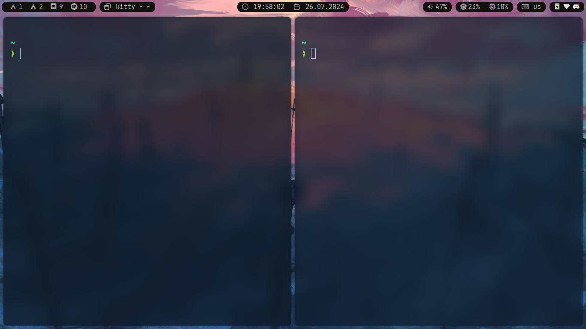

# My Personal Dotfiles
This repository contains my personal dotfiles for configuring my development environment. It includes configurations for various tools and applications that I use regularly.

## Screenshot



## What i use
- **Editor**: [NeoVim](https://neovim.io/)
- **Terminal**: [Kitty](https://sw.kovidgoyal.net/kitty/) 
- **Shell**: [Zsh](https://github.com/ohmyzsh/ohmyzsh/wiki/Installing-ZSH) with [Starship](https://starship.rs/) prompt
- **Window Manager**: [Hyprland](https://hyprland.org/) 
- **Lock Screen**: [Hyprlock](https://github.com/hyprwm/hyprlock)
- **Notification Daemon**: [Swaync](https://github.com/ErikReider/SwayNotificationCenter)
- **Terminal Multiplexer**: [Tmux](https://github.com/tmux/tmux)
- **Bar**: [Waybar](https://github.com/Alexays/Waybar)
- **Font**: [Maple Mono](https://github.com/subframe7536/maple-font)

## How to use
To use these dotfiles, you can clone the repository and create symbolic links to the appropriate locations in your home directory. Here's a basic example of how to do this:

```bash
git clone git@github.com:luxuling/dotfiles.git
cd dotfiles
stow .
```

Make sure to adjust the paths and commands according to your specific setup and preferences.

## License
This repository is licensed under the MIT License. See the [LICENSE](./LISENCE.TXT) file for more details.
