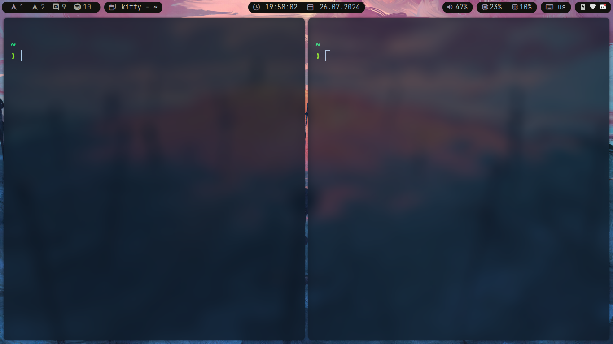

## What i use

- [Neovim](https://neovim.io/) for the **_Code editor_**
- [I3wm](https://i3wm.org/) for the **_Window manager_**
- [Polybar](https://github.com/polybar/polybar) for the **_Status bar_**
- [Dunst](https://github.com/dunst-project/dunst) for the **_Notification_**
- [Picom](https://github.com/yshui/picom) for the **_Compositor_**
- [Rofi](https://github.com/davatorium/rofi) for the **_Menu_**
- [Kitty](https://github.com/kovidgoyal/kitty) for the **_Terminal_**

### Screenshot

